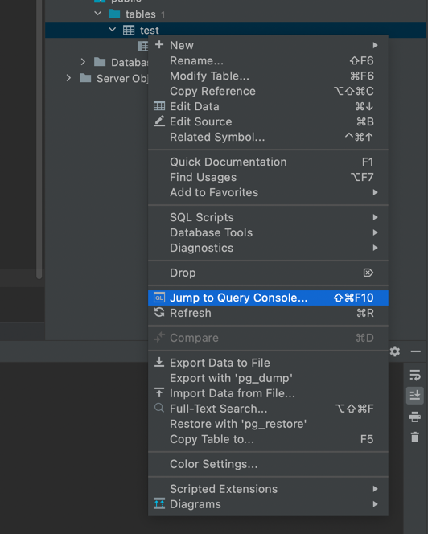

### Запуск

```
cd docker-settings
cp .env.example .env

docker-compose up -d --build
```

### Структура
```
app/web/index.php      точка входа приложения
config                 настройка приложения
src                    код приложения
```


Открыть терминал базы (sql)  
Открыть справа database  
правой кнопкой (два пальца трекпад) по таблице и нажать Jump to query console  


сохранить команду в текстовый файл  

